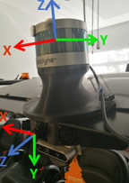
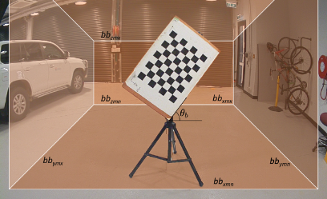
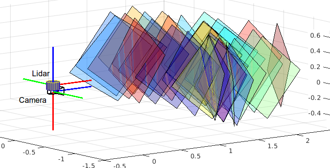
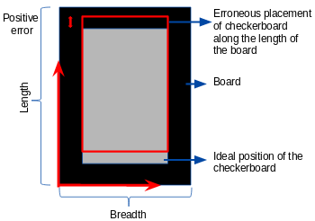
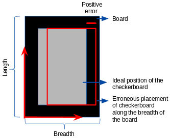
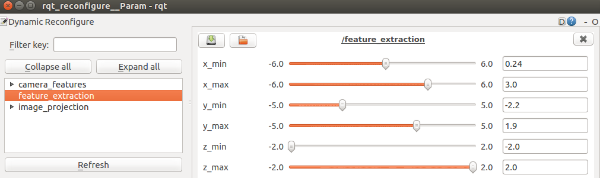

# ROS package to determine the extrinsic calibration parameters (3D rotation and translation) between a camera and a lidar.

## Experimental Setup

1. To make a calibration target, firmly attach a checkerboard on a rigid, opaque, and rectangular board such that both their centres align and their edges remain parallel to one another.
2. Mount the target on a stand such that it is tilted at an angle of 45-60 degrees with respect to the ground plane. 
3. Choose a stand to hang the target in a way that it does not hold the board with significant protruding elements close to the board boundaries or corners.

## Data Collection

1. For calibration, it is required to place the target in different locations and orientations relative to the camera-lidar sensor pair.
2. Make sure that the 3D experimental region in which the target will be placed is free from any other objects apart from the board and its stand. 
3. Ensure that the entire board is visible to both sensors. 
3. A minimum of 3 checkerboard poses or samples are to be collected. Satisfactory calibration results are obtained with around 9 samples. 
In general, calibration accuracy improves as more samples are collected.

## Pre-requisites 

1. Ensure that the camera and the lidar have ros drivers such that the device output is a ROS message. 
2. Enter the following in the described order in `cfg/initial_params.txt`
- Name of the image topic 
- Name of the point cloud topic 
- Type of camera lens (1 for fisheye; 0 for pinhole)
- Number of lidar beams (Eg. 16, 32, 64 etc)
- Size of the checkerboard (Eg. 8X6 written as 8 6)
- Side length of each square in the checkerboard in millimetres (mm) (Eg. 65)
- Length and breadth of the target in mm (Eg. 905 600 ; length = 905 mm, breadth = 600 mm)
- Error in checkerboard placement along the length and breadth of the rectangular board. 
Ideally, the checkerboard centre should align with the board centre. However, if that's not the case, you can account for the translational errors along the length 
and breadth of the board atop which the checkerboard is fixed. 
For error along the length, if the checkerboard centre is above the board centre, the error (in mm) is positive else it is negative.
For error along the breadth, if the checkerboard centre is shifted to the right of the board centre, the error (in mm) is positive else it is negative. 
(Eg. 20 0; +20 mm error along the length of the board and 0 mm error along the breadth of the board. i.e in our case the checkerboard is shifted up from its 
original position by 20 mm)

- 3X3 Camera intrinsic matrix (Units in mm)
- Number of camera distortion coefficients (Our distortion function uses 4 coefficients for fisheye lens and 5 coefficients for pinhole lens)
- Camera distortion coefficients
- Image Size in pixels (Eg. 1920 1208)

## Procedure 

1. Launch the calibration package
`roslauch cam_lidar_calibration cam_lidar_calibration.launch`

2. Rviz and reconfigure_gui will open up.

3. Rviz is used to visualize the features in the point cloud and the image. The end result - point cloud projection on the image - is also shown. 

The subscribed images are 
- Raw camera image (change the image topic)
- camera image with checkerboard features
- point cloud projection on the image

The subscribed point clouds are 
- Experimental region point cloud
- Target plane and features

4. In the GUI, choose the node `feature_extraction` from `camera_features`. 
You will see slider bars corresponding to the bounds of the 3D experimental region along the lidar's x, y, and z axis. 
The slider bars can be varied and the corresponding experimental region can be visualized in Rviz. 

5. Start the data collection process by placing the checkerboard facing the sensor pair. 
If you are doing offline calibration, i.e. if you have a rosbag with recorded samples, then run the bag. 
`rosbag play samples.bag`, where `samples.bag` is the name of your rosbag.

6. Press keyboard keys to perform the following tasks. 
- ‘i’ to collect a sample. 
As soon as 'i' is pressed, features can be seen in the point cloud and in the image (in Rviz). 
- ‘enter’ to include the collected sample for optimization. 
At times, the collected sample doesn't yield good features. 
This could be due to improper experimental region bounds or lesser number of scan lines passing each edge of the target. 
If that's the case, 'enter' need not be pressed. 
- ‘o’ to begin the optimization process after sample inclusion.

7. The extrinsic parameters are displayed in the terminal and the point cloud projection on the image can be seen in Rviz.

For more information, view the calibration paper: https://arxiv.org/abs/1904.12433

