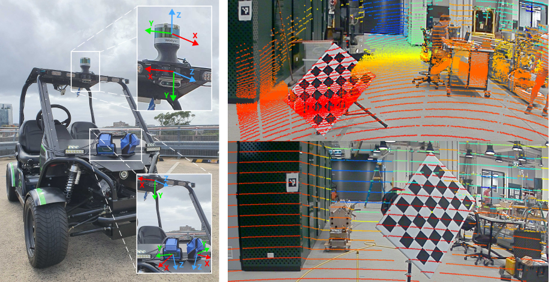
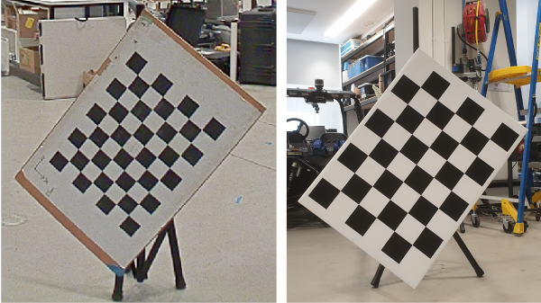
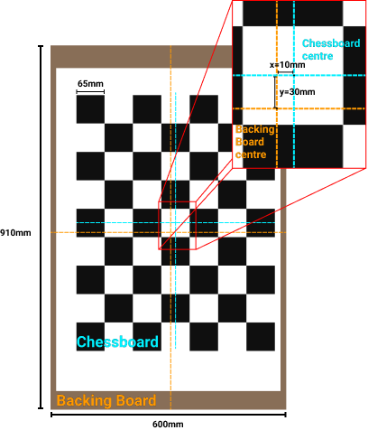
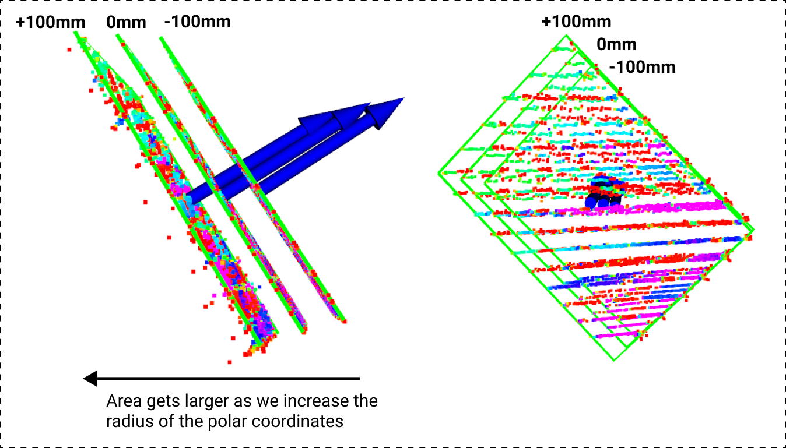
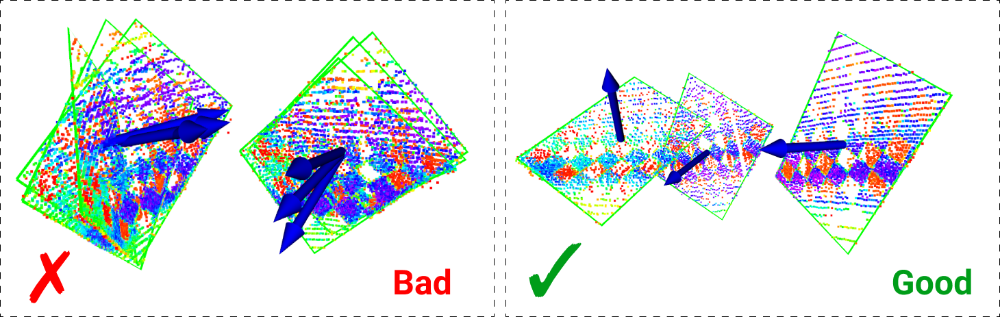
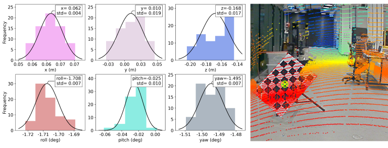

# Camera-LiDAR Calibration - V 3.0 (ROS2 Jazzy)

This is the ROS2 Jazzy version of the official code release of the ITSC 2021 paper, ["Optimising the selection of samples for robust lidar camera calibration"](https://arxiv.org/abs/2103.12287).

**Note:** This package has been fully migrated to ROS2 Jazzy with modern C++17 features.
- For ROS1 Melodic (V1.0 - original implementation), switch to the `master` branch
- For ROS1 Melodic (V2.0 - improved UI), switch to the `melodic` branch
- For ROS2 Jazzy (V3.0 - current), use the `jazzy_dev` branch

This package estimates the calibration parameters that transforms the camera frame (parent) into the lidar frame (child). We aim to simplify the calibration process by optimising the pose selection process to take away the tedious trial-and-error of having to re-calibrate with different poses until a good calibration is found. We seek to obtain calibration parameters as an estimate with uncertainty that fits the entire scene instead of solely fitting the target, which many existing works struggle with. Our proposed approach overcomes the limitations of existing target-based calibration methods, namely from user error and overfitting of the target. For more details, please take a look at our paper.

<p align="center">

<br>
<em><b>Left:</b> Our sensor setup at the Australian Centre for Field Robotics (ACFR). <b>Right:</b> Calibration results of this package with an Nvidia gmsl camera to both Baraja Spectrum-Scan™ (top) and Velodyne VLP-16 (bottom). The projection of Baraja Spectrum-Scan™ has some ground points (yellow) on the chessboard due to the difference in perspective of camera and lidar.</em>
</p>

<b>Note:</b> In the paper, equation (2) which shows the equation for the condition number has a typo. The correct equation for calculating the condition number is  implemented in this repo. The formula is: 

# Changelog - What's New in V3 (ROS2 Jazzy)?

## Major Changes
- ✅ **Full ROS2 Jazzy migration** with `rclcpp` and `ament_cmake`
- ✅ **Modern C++17 features** for improved performance and safety
- ✅ **Docker two-image setup** for fast development iteration
- ✅ **tf2 library** replacing ROS1 tf transformations
- ✅ **Custom outlier removal** to avoid FLANN C++17 compatibility issues
- ✅ **RViz2 panel** for interactive calibration workflow

## From V2
- Feature extraction UI with region of interest selection
- Background subtraction for automatic board detection
- Running average of 5 consecutive frames for robust parameter estimation
- Angle wrapping in visualization to prevent discontinuities at ±2π
- Code formatting with consistent style enforcement

# 1. Getting started
## 1.1 Installation

### Prerequisites
- **ROS2 Jazzy** installed ([installation guide](https://docs.ros.org/en/jazzy/Installation.html))
- **PCL 1.14+** (included in ROS2 Jazzy desktop-full)
- **OpenCV 4.x** (included in ROS2 Jazzy desktop-full)
- **Qt5** for RViz2 panels

### Local Installation

1. Clone the repository in your ROS2 workspace `src/` folder
```bash
cd ~/ros2_ws/src
git clone https://github.com/acfr/cam_lidar_calibration -b jazzy_dev
```

2. Install dependencies
```bash
cd ~/ros2_ws
rosdep install --from-paths src --ignore-src -r -y
```

3. Install Python dependencies
```bash
pip3 install pandas scipy numpy matplotlib
```

4. Build the package
```bash
cd ~/ros2_ws
colcon build --packages-select cam_lidar_calibration --symlink-install
source install/setup.bash
```

### Docker (Recommended)

Docker provides a consistent ROS2 Jazzy environment with all dependencies pre-installed. The setup uses a **two-image architecture**:
- **Base image** (~4-5GB): Contains all ROS2 and system dependencies, built once
- **Dev image**: Lightweight layer that mounts your source code for fast iteration

**Quick Start with Makefile (Easiest):**
```bash
cd docker
make build-all    # First time: builds both images (~10-15 min)
make run          # Start container with GPU
make exec         # Enter container
make build-pkg    # Build the package
```

**Or using shell scripts:**
```bash
cd docker
./build.sh --all              # Build both images
./run.sh                      # Start with GPU
# OR
./run.sh --cuda off           # Start without GPU

docker compose exec dev bash  # Enter container
colcon build --packages-select cam_lidar_calibration --symlink-install
```

**Key Features:**
- Source code mounted from host (edit on host, compile in container)
- Build artifacts persisted in Docker volumes
- Dev image rebuilds in seconds after dependency changes
- GPU support with NVIDIA Docker runtime

For detailed Docker usage and troubleshooting, see [docker/README.md](docker/README.md).

## 1.2 Quick start

You can verify that this repository runs successfully by running this package on our provided quick-start data.

**1. Run the calibration process**

This first step takes the saved poses, computes the best sets with the lowest VOQ score.
```bash
ros2 launch cam_lidar_calibration run_optimiser.launch.py import_samples:=true
```
After calibration, the output is saved in the same directory as the imported samples. For this quickstart example, the output is saved in `cam_lidar_calibration/data/vlp/`.

**2. Obtain and assess calibration results**

This step gives the estimated calibration parameters by taking a filtered mean of the best sets, and displaying the gaussian fitted histogram of estimated parameters. Additionally, we provide an assessment of the calibration results by computing the reprojection error over all provided data samples and a visualisation (if specified).

To obtain and assess the calibration output, provide the absolute path of the csv output file generated in the first step:
```bash
ros2 launch cam_lidar_calibration assess_results.launch.py \
  csv:=/path/to/calibration_output.csv \
  visualise:=true
```

That's it! If this quick start worked successfully, you can begin using this tool for your own data. If not, please create an issue and we'll aim to resolve it promptly.

# 2. Calibration with your own data

To use this package with your own data, ensure that your bag file has the following topics:
- **Lidar**: 3D pointcloud of point type XYZIR, published as [sensor_msgs::PointCloud2](http://docs.ros.org/en/api/sensor_msgs/html/msg/PointCloud2.html). This package relies on the ring value and so if you don't have that, you need to modify your lidar driver to use this package.
- **Monocular camera:** an image published as [sensor_msgs::Image](http://docs.ros.org/en/api/sensor_msgs/html/msg/Image.html) and the corresponding meta-information topic ([sensor_msgs::CameraInfo](http://docs.ros.org/en/api/sensor_msgs/html/msg/CameraInfo.html)).

All data and output files will be saved in the `cam_lidar_calibration/data/YYYY-MM-DD_HH-MM-SS/` folder.

## 2.1 Setup of Calibration Target

1. Prepare a rectangular chessboard printout. The chessboard print used in the paper is an A1 (594 x 841mm) with 95mm squares and 7x5 inner vertices (not the same as the number of grid squares), downloaded from https://markhedleyjones.com/projects/calibration-checkerboard-collection
2. Firmly attach the chessboard on a rigid, opaque, and rectangular board such that both their centres align (as best as possible) and their edges remain parallel to one another.
3. Choose a suitable stand that can mount the target with little to no protruding elements from the board's edges.
4. Rotate the chessboard such that it is in the shape of a diamond (at an angle of 45° with respect to the ground) and mount it on a stand.

In the image below, we show two chessboards rigs that we've used with this package.

<p  align="center">
    
    <br>
    <em><b>Left:</b> chessboard with 8x6 inner vertices and 65mm squares. <b>Right:</b> chessboard with 7x5 inner vertices and 95mm squares.</em>
</p>

## 2.2 Configuration files

The following explains the fields in /cfg/params.yaml

**1. Specify the names of your lidar and camera topics.** For example, in our case it is:
```
camera_topic: "/gmsl/A0/image_color"
camera_info: "/gmsl/A0/camera_info"
lidar_topic: "/velodyne/front/points"
```
**2. (optional) Specify the default bounds of the pointcloud filtering**. If you are unsure, feel free to skip this step.

**3. Input the details about the chessboard target you prepared:**

- pattern_size: these are the inner vertices of the chessboard (not the number of squares; see our chessboards in Section 2.1)
- square_length (mm): the length of a chessboard square.
- board_dimension (mm): width and height of the backing board that the chessboard print is mounted on.
- translation_error: the offset of the chessboard centre from the centre of the backing board (see illustration below).

<p  align="center">
    
    <br>
    <em><b>Example:</b> In this example, the offset is x=10mm, y=30mm, board dimensions are 910x650mm with square lengths of 65mm and pattern size of 8x6 (HxW).</em>
</p>

## 2.3 Capture poses and get the best sets of calibration parameters

### 1. Launch calibration package
Run the calibration package with the `import_samples` flag set to false. An RViz2 window with the custom calibration panel should open.

```bash
ros2 launch cam_lidar_calibration run_optimiser.launch.py import_samples:=false
```

This process can be done online or offline. If you are offline, make sure to play the ROS2 bag:
```bash
ros2 bag play mybag/
```

If you're running in Docker, you can play the bag file from a separate terminal outside the container.

**Troubleshooting:**
- If RViz2 doesn't open in Docker, check X11 forwarding: `xhost +local:docker`
- To change the camera topic, edit `rviz/cam_lidar_calibration.rviz` or use RViz2 UI: Panels → Displays → Image → Topic

### 2. Scan a static scene without the chessboard

Using the **RViz2 Camera-LiDAR Calibration panel**, modify the values of the x, y, and z axes limits to isolate a region where the scene is static (no moving objects). For example, in a lab environment with people moving around, you can use the sliders to define a region of interest in the point cloud.

Once you're satisfied with your static scene, press **'Capture Background'**. This package will then perform background subtraction in every subsequent frame to automatically detect new objects (like the chessboard) in the scene.

### 3. First sample of the chessboard

Place your chessboard facing perpendicular to the ground, in the middle, facing the lidar and camera(s). We recommend that the first sample is a very clear shot of the board, so placing it straight and roughly in the middle is recommended.

Press the 'Capture Sample' button. Make sure nothing else apart from the board and its tripod is in the frame. The board extraction does a good job in detecting the board from the tripod.

Make sure that the chessboard is correctly outlined with a low board dimension error. If it isn't, then 'Discard Sample' and click 'Capture Sample' again (or move the board and capture again).


**Board errors (in the terminal window)**: Try to get a board dimension error as close to zero as possible (errors less than 30mm are acceptable). If the board dimension error is too high, then try again in a different position or see below for potential fixes.

- High board errors can be caused by the chessboard being too close or too far from the lidar. So we recommend moving it a bit closer/further.

- Low resolution lidars may struggle to capture boards with low error if there are not enough points on the board. For example, for the VLP-16, we require at least 7 rings on the board for a decent capture.

- If the chessboard is consistently under or overestimated with the same amount of board error, then it could be that the lidar's internal distance estimation is not properly calibrated. Lidars often have a range error of around +/-30mm and this is inconsistent at different ranges. We've provided a param in the `run_optimiser.launch` file that allows you to apply an offset to this distance estimation. Try to set the offset such that you get the lowest average error for your data (you might need to re-capture a couple times to figure this value). For our VLP-16 we had to set `distance_offset_mm=-30`. This should be permanently set in the lidar driver once you've finished calibrating.

<p  align="center">
    
    <br>
    <em> In the left image above, we show the same pose at 3 different <b>distance offsets</b>. We add a distance offset by converting the cartesian (xyz) coordinates to polar (r, theta) and add a distance offset to the radius r. When we do this, you can think of it like extending/reducing the radius of a circle. Every shape in that new coordinate system is hence enlarged/shrunk. Increasing the distance offset value increases the chessboard area (+100mm is the largest). The right image is the same as the left, just with a different perspective to show that the increase is in both height and width of the chessboard.</em>
</p>

### 4. Subsequent samples of the chessboard

For every other capture, place the chessboard in different configurations and positions and take as many samples as you need. Before capturing the sample make sure you or whoever is moving the board is not in the scene after placing the board in its new pose.

You can always discard the last captured sample by pressing 'Discard Sample' button if the board dimension error is not low.

**Number and variation of poses**: We recommend that you capture at least 10-20 poses with at least a 1-2m distance range (from lidar centre) between closest and farthest poses. Below lists some guidelines.

- Spread the poses out in the calibration range, covering the width of the image field of view. For our specific VLP-16 and Baraja Spectrum Scan lidars, we had a range of 1.7m - 4m and 2.1m - 5m respectively.

- Have variation in the yaw and pitch of the board as best as you can. This is explained in the following image.

<p  align="center">
    
    <br>
    <em>For the <b>bad poses (left)</b>, the normals of the board align such that their tips draw out a line and they are all in the same position, thereby giving a greater chance of overfitting the chessboard at that position. For the <b>good poses (right)</b>, we see variation in the board orientation and positioning. </em>
</p>

### 5. Optimise

Once you are happy with your samples press the 'Optimise' button.

Note that if you do not click this button, the poses will not be properly saved.

The poses are saved (png, pcd, poses.csv) in the `($cam_lidar_calibration)/data/YYYY-MM-DD_HH-MM-SS/` folder for the reprojection assessment phase (and also if you wish to re-calibrate with the same data). The optimisation process will generate an output file `calibration_YYYY-MM-DD_HH-MM-SS.csv` in the same folder which stores the results of the best sets.


## 2.4 Estimating parameters and assessing reprojection error

After you obtain the calibration csv output file, copy-paste the absolute path of the calibration output file after `csv:=` in the command below with double quotation marks. A histogram with a gaussian fitting should appear. You can choose to visualise a sample if you set the visualise flag. If you wish to visualise a different sample, you can change the particular sample in the `assess_results.launch` file. The reprojection results are shown in the terminal window.

The final estimated calibration parameters can be found in the terminal window or taken from the histogram plots.

```bash
ros2 launch cam_lidar_calibration assess_results.launch.py \
  csv:=/path/to/calibration_output.csv \
  visualise:=true
```

For the quickstart example:
```bash
ros2 launch cam_lidar_calibration assess_results.launch.py \
  csv:=$(ros2 pkg prefix cam_lidar_calibration)/../../src/cam_lidar_calibration/data/vlp/calibration_quickstart.csv \
  visualise:=true
```

<p  align="center">
    
    <br>
    <em>Output of our calibration pipeline shows a histogram with a gaussian fit and a visualisation of the calibration results with reprojection error. </em>
</p>

## More Information

The baseline calibration algorithm was from Verma, 2019. You can find their [paper](https://arxiv.org/abs/1904.12433), and their publicly available [code](https://gitlab.acfr.usyd.edu.au/sverma/cam_lidar_calibration).

Please cite our work if this package helps with your research.
```
@INPROCEEDINGS{verma_ITSC2019,
  author={Verma, Surabhi and Berrio, Julie Stephany and Worrall, Stewart and Nebot, Eduardo},
  booktitle={2019 IEEE Intelligent Transportation Systems Conference (ITSC)}, 
  title={Automatic extrinsic calibration between a camera and a 3D Lidar using 3D point and plane correspondences}, 
  year={2019},
  volume={},
  number={},
  pages={3906-3912},
  keywords={Cameras;Three-dimensional displays;Laser radar;Calibration;Robot sensing systems;Feature extraction;Lasers},
  doi={10.1109/ITSC.2019.8917108}}

@INPROCEEDINGS{tsai2021optimising,
  author={Tsai, Darren and Worrall, Stewart and Shan, Mao and Lohr, Anton and Nebot, Eduardo},
  booktitle={2021 IEEE International Intelligent Transportation Systems Conference (ITSC)},
  title={Optimising the selection of samples for robust lidar camera calibration},
  year={2021},
  volume={},
  number={},
  pages={2631-2638},
  doi={10.1109/ITSC48978.2021.9564700}}
```
